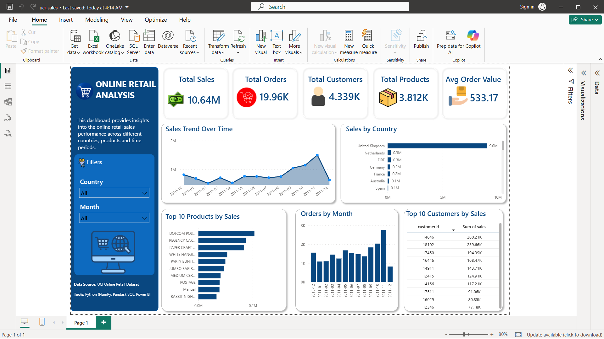

# Online Retail Analysis 📊

This is my data analytics project based on the **UCI Online Retail Dataset**.

I worked on the data using Python and SQL, cleaned the dataset, and then created a dashboard in Power BI to understand the sales and customer data.

## Dashboard

## What I worked on

- Cleaned the raw data
- Checked and handled missing values
- Worked with dates and columns
- Analyzed sales and orders
- Found top selling products
- Analyzed sales by country
- Checked monthly sales trends
- Found top customers by sales
- Created SQL queries for analysis
- Created an interactive Power BI dashboard

## Tools I used

- Python
- Pandas
- NumPy
- Jupyter Notebook
- SQL
- Power BI
- Excel

## Project Files

- `Online Retail.xlsx` → Original dataset
- `online_retail_clean.csv` → Cleaned dataset
- `online_retail_analysis.ipynb` → Python analysis
- `online_retail_sql_analysis.sql` → SQL queries
- `uci_sales.pbix` → Power BI dashboard
- `images/` → Dashboard images

## Dashboard Includes

- Total Sales
- Total Orders
- Total Customers
- Total Products
- Average Order Value
- Sales Trend Over Time
- Sales by Country
- Top 10 Products by Sales
- Sales by Month
- Top 10 Customers by Sales
- Country and Month filters

## Dataset

I used the **UCI Online Retail Dataset** for this project.

## My Learning

This project helped me practice working with real-world data and understand how Python, SQL and Power BI can be used together in a data analytics project.
